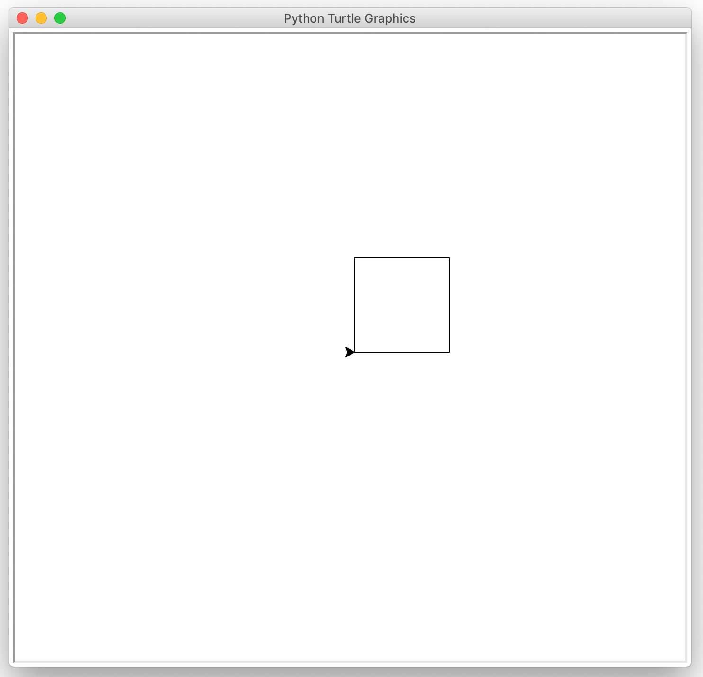

# 🐢 Quadrat

Ihr erstes Python-Programm wird die Turtle dazu anweisen, ein Quadrat zu zeichnen. Mit diesem Programm können Sie gleichzeitig prüfen, ob die Installation der IDE geklappt hat.

1. Erstellen Sie eine neue Python-Datei `quadrat.py`.
2. Tippen Sie in die neu erstellte Python-Datei [dieses Programm](quadrat.md#source-code) ab.
3. Führen Sie das Programm aus und prüfen Sie, ob ein Quadrat gezeichnet wird. Es sollte sich ein Fenster öffnen und ein "kleines Dreieck" sollte [die Zeichnung](quadrat.md#screenshot) erstellen.

### Ressourcen

#### Source Code


```python
import turtle

turtle.forward(100)
turtle.left(90)
turtle.forward(100)
turtle.left(90)
turtle.forward(100)
turtle.left(90)
turtle.forward(100)
turtle.left(90)
turtle.done()
```


#### Screenshot


